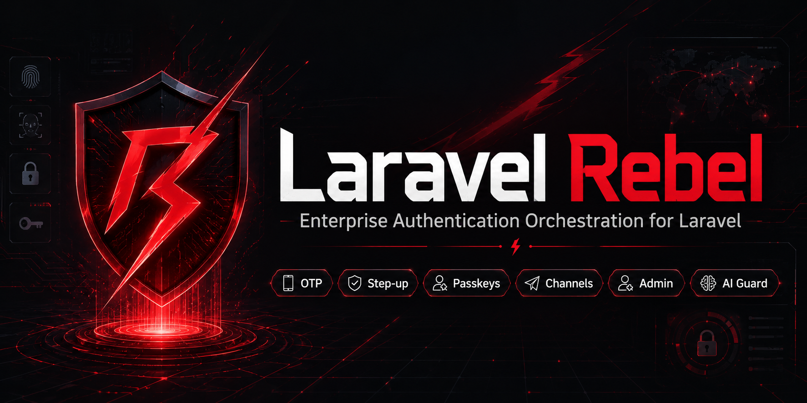

# Laravel Rebel — Fortify Bridge

> **Make Laravel Fortify's factors first-class step-up methods.** This bridge turns Fortify's password confirmation, TOTP two-factor, and passkeys into Rebel **step-up drivers** — so you can require the *right strength* of re-authentication per sensitive action — and it folds Fortify's login/2FA events into one unified Rebel **audit trail**. It also ships a **passkey-first login** flow with an email-OTP fallback. Part of the `padosoft/laravel-rebel-*` suite.

<p align="center">
  
</p>

<p align="center">
  
  
  
  
  
  
</p>

---

## Table of contents

- [What it is (and what it is not)](#what-it-is-and-what-it-is-not)
- [Quick glossary (one minute)](#quick-glossary-one-minute)
- [Why this bridge — the moats](#why-this-bridge--the-moats)
- [Rebel Fortify Bridge vs the alternatives](#rebel-fortify-bridge-vs-the-alternatives)
- [How it works (step by step)](#how-it-works-step-by-step)
- [Installation (junior-proof)](#installation-junior-proof)
- [Configuration (every option)](#configuration-every-option)
- [Usage examples](#usage-examples)
  - [1. Require a strong step-up for a sensitive action](#1-require-a-strong-step-up-for-a-sensitive-action)
  - [2. Password re-confirmation (sudo mode)](#2-password-re-confirmation-sudo-mode)
  - [3. TOTP and recovery codes](#3-totp-and-recovery-codes)
  - [4. Passkey step-up (phishing-resistant)](#4-passkey-step-up-phishing-resistant)
  - [5. Passkey-first login with email-OTP fallback](#5-passkey-first-login-with-email-otp-fallback)
  - [6. Unified audit trail](#6-unified-audit-trail)
- [The assurance hierarchy (important)](#the-assurance-hierarchy-important)
- [`.env.example`](#envexample)
- [Security notes](#security-notes)
- [Testing & License](#testing--license)

---

## What it is (and what it is not)

**It is** the glue between [Laravel Fortify](https://github.com/laravel/fortify) and the
Rebel step-up engine ([`padosoft/laravel-rebel-step-up`](https://github.com/padosoft/laravel-rebel-step-up)).
Fortify gives your app password/2FA/passkey *plumbing*; Rebel gives you a *policy* layer
("this action needs AAL2 + phishing-resistant"). This bridge lets the two talk: Fortify's
factors become Rebel step-up **drivers**, and Fortify's auth **events** become Rebel audit records.

**It is not** a login UI and it does not replace Fortify — keep using Fortify for
registration, login, 2FA enrolment and passkey management. This package adds the
*re-authentication policy* and *audit unification* on top.

Depends on [`padosoft/laravel-rebel-core`](https://github.com/padosoft/laravel-rebel-core)
and [`padosoft/laravel-rebel-step-up`](https://github.com/padosoft/laravel-rebel-step-up).
Fortify itself is **optional** (feature-detected): without it, the password-confirm driver
still works and the Fortify-only pieces are simply skipped.

---

## Quick glossary (one minute)

| Term | In plain words |
|---|---|
| **Step-up** | "You're already logged in, but for THIS action prove it's really you again." |
| **Step-up driver** | A way to perform that proof: password, TOTP, passkey… Each declares the strength it provides. |
| **AAL** (Authenticator Assurance Level) | NIST strength level. `aal1` = one factor (e.g. a password); `aal2` = two factors / stronger. |
| **AMR** | *Authentication Methods References* — the methods used, e.g. `['pwd']`, `['otp','totp']`, `['webauthn']`. |
| **Phishing-resistant** | A proof phishing can't steal — typically a **passkey/FIDO2**. A password or a TOTP is **not**. |
| **TOTP** | The 6-digit code from an authenticator app (Google Authenticator, 1Password…). |
| **Recovery code** | A one-time backup code used when the authenticator device is unavailable. |
| **Audit trail** | One table (`rebel_auth_events`) where every auth event lands, regardless of which library produced it. |

---

## Why this bridge — the moats

| ★ | What | In short |
|---|---|---|
| ★★★ | **Per-action strength** | Require `aal2` + phishing-resistant for a payout, just a password for a profile tweak — declaratively, via step-up policies. |
| ★★★ | **NIST-correct assurance** | Password = AAL1, TOTP = AAL2, passkey = AAL2 phishing-resistant. No over-claiming: a password can't satisfy a high-assurance action. |
| ★★★ | **Replay-resistant by design** | Passkey confirmations are bound to a single-use server challenge; recovery codes are consumed atomically (row-locked). |
| ★★ | **Unified audit** | Fortify logins, failures, lockouts and 2FA events all land in `rebel_auth_events` — lockouts with HMAC'd IP/identifier (no plaintext PII). |
| ★★ | **Passkey-first login** | Offer passkeys first, fall back to email-OTP automatically when the user has none. |
| ★★ | **Optional Fortify** | Feature-detected: installs and partly works even without Fortify; no hard crash. |
| ★ | **Pluggable passkeys** | Bring your own WebAuthn implementation via a tiny contract; a fake ships for tests. |

---

## Rebel Fortify Bridge vs the alternatives

How "re-authenticate before a sensitive action" looks with each approach:

| Capability | **Rebel Fortify Bridge** | Fortify alone | Laravel `password.confirm` | Hand-rolled |
|---|:---:|:---:|:---:|:---:|
| Re-confirm with a password | ✅ | ✅ | ✅ | ✅ |
| Re-confirm with **TOTP** | ✅ | ❌ | ❌ | ❌ |
| Re-confirm with a **passkey** | ✅ | ❌ | ❌ | ❌ |
| **Per-action** required strength (AAL/AMR) | ✅ | ❌ | ❌ | ❌ |
| Rejects a factor **below** the required assurance | ✅ | ❌ | ❌ | ❌ |
| Passkey confirm bound to a single-use challenge | ✅ | ➖ | ❌ | ❌ |
| Atomic, single-use recovery codes for step-up | ✅ | ➖ (login only) | ❌ | ❌ |
| Confirmation decays after a TTL | ✅ | ➖ | ✅ | ❌ |
| **PSD2/SCA dynamic linking** (amount+payee) | ✅ (via step-up) | ❌ | ❌ | ❌ |
| Unified audit trail across login + 2FA + step-up | ✅ | ❌ | ❌ | ❌ |
| Lockout audit with HMAC'd IP/identifier | ✅ | ❌ | ❌ | ❌ |
| Multi-tenant aware | ✅ | ❌ | ❌ | ❌ |

> Legend: ✅ built-in · ➖ partial / only in a narrow flow · ❌ not available. Fortify is
> excellent at what it does (login, 2FA enrolment, passkey management) — this bridge builds
> the *policy + audit* layer on top of it, it does not compete with it.

---

## How it works (step by step)

```
You configure a step-up "purpose" (in laravel-rebel-step-up) and list the drivers it accepts:

  'checkout-credit-order' => [
      'required_assurance' => 'aal2',
      'require_phishing_resistant' => true,
      'drivers' => ['fortify_passkey_confirm', 'fortify_totp'],  // <- from THIS bridge
  ]
        |
        v
This bridge registers fortify_password_confirm / fortify_totp / fortify_passkey_confirm
into the step-up DriverRegistry at boot (each only if it can actually work).
        |
        v
When the user hits a protected action, the step-up engine picks the best allowed driver:
  - passkey available?  -> issue a challenge, verify the assertion (phishing-resistant, AAL2)
  - else TOTP?          -> verify the 6-digit code or a recovery code (AAL2)
  - else password?      -> verify the password (AAL1)  [only if the policy allows AAL1]
        |
        v
Meanwhile, every Fortify/framework auth event (login, failure, lockout, 2FA enabled...)
is mapped into rebel_auth_events -- one audit trail for the whole stack.
```

---

## Installation (junior-proof)

> Prerequisites: Laravel **12 or 13**, PHP **8.3+**, and `padosoft/laravel-rebel-core` +
> `padosoft/laravel-rebel-step-up` installed (they come as dependencies). [Laravel
> Fortify](https://github.com/laravel/fortify) is recommended but optional.

**1) Require the package**

```bash
composer require padosoft/laravel-rebel-bridge-fortify
```

**2) (Recommended) install Fortify and enable two-factor / passkeys**

```bash
composer require laravel/fortify
php artisan fortify:install
php artisan migrate
```

Enable the features you want in `config/fortify.php` (e.g. `Features::twoFactorAuthentication()`).
See the [Fortify docs](https://laravel.com/docs/fortify) for the enrolment UI.

**3) Publish the bridge config (optional)**

```bash
php artisan vendor:publish --tag="rebel-bridge-fortify-config"
```

**4) Use the drivers in your step-up policies** (`config/rebel-step-up.php`):

```php
'purposes' => [
    'change-email' => [
        'required_assurance' => 'aal1',
        'drivers' => ['fortify_password_confirm'],
    ],
    'checkout-credit-order' => [
        'required_assurance' => 'aal2',
        'require_phishing_resistant' => true,
        'drivers' => ['fortify_passkey_confirm', 'fortify_totp'],
    ],
],
```

That's it — the bridge has already registered the drivers; the step-up engine will use them.

---

## Configuration (every option)

File `config/rebel-bridge-fortify.php`:

| Key | Default | What it does |
|---|---|---|
| `drivers.password_confirm` | `true` | Register the `fortify_password_confirm` step-up driver (works even without Fortify). |
| `drivers.totp` | `true` | Register `fortify_totp` — only when Laravel Fortify is installed. |
| `drivers.passkey` | `true` | Register `fortify_passkey_confirm` — only when a `PasskeyConfirmer` is bound (see below). |
| `audit_events` | `true` | Map framework + Fortify auth events into `rebel_auth_events`. |

To enable the **passkey** driver, bind your WebAuthn implementation:

```php
// In a service provider
use Padosoft\Rebel\Bridge\Fortify\Contracts\PasskeyConfirmer;

$this->app->singleton(PasskeyConfirmer::class, MyWebAuthnPasskeyConfirmer::class);
```

(For passkey-first **login** you bind `PasskeyAuthenticator` the same way.)

---

## Usage examples

### 1. Require a strong step-up for a sensitive action

Protect a route with the step-up middleware (from `laravel-rebel-step-up`); this bridge
supplies the factors the policy is allowed to use:

```php
Route::middleware(['auth', 'rebel.stepup:checkout-credit-order'])
    ->post('/checkout/confirm', [CheckoutController::class, 'confirm']);
```

With the policy above, the engine will demand a **passkey** (or TOTP) — a password alone
won't pass, because it's only AAL1.

### 2. Password re-confirmation (sudo mode)

```php
// config/rebel-step-up.php
'delete-account' => [
    'required_assurance' => 'aal1',
    'drivers' => ['fortify_password_confirm'],
],
```

```php
// The user re-enters their password; the driver verifies it via the framework hasher.
$result = app(\Padosoft\Rebel\StepUp\RebelStepUp::class)
    ->confirm($challengeId, $request->string('password'), $ctx);
```

### 3. TOTP and recovery codes

When the policy lists `fortify_totp`, the user submits their 6-digit code — or, if they
lost their device, a **recovery code** (consumed once, atomically):

```php
$result = $stepUp->confirm($challengeId, $request->string('code'), $ctx);
// '123456'        -> verified via the authenticator app
// 'ABCD-EFGH-...' -> verified via a recovery code (then invalidated)
```

### 4. Passkey step-up (phishing-resistant)

```php
// 1) start() issues a single-use challenge -- send it to the browser
$start = $stepUp->start($ctx);              // $start->reference = the WebAuthn challenge

// 2) the browser produces an assertion via navigator.credentials.get(); verify it
$result = $stepUp->confirm($start->challengeId, $assertionJson, $ctx);
```

The assertion is verified against *that* challenge, so a captured assertion cannot be replayed.

### 5. Passkey-first login with email-OTP fallback

```php
use Padosoft\Rebel\Bridge\Fortify\PasskeyFirstLogin;

public function begin(Request $request, PasskeyFirstLogin $login)
{
    $options = $login->begin($request->string('email'));

    if ($options === null) {
        // No passkey for this user -> fall back to email-OTP (laravel-rebel-email-otp)
        return response()->json(['fallback' => 'email_otp']);
    }

    // Persist the challenge (e.g. in the session) to bind it on completion
    $request->session()->put('passkey_challenge', $options['challenge']);

    return response()->json(['passkey' => $options]);
}

public function complete(Request $request, PasskeyFirstLogin $login)
{
    $user = $login->complete(
        $request->string('assertion'),
        (string) $request->session()->pull('passkey_challenge'),
    );

    return $user !== null
        ? response()->json(['ok' => true])
        : response()->json(['error' => 'invalid'], 422);
}
```

### 6. Unified audit trail

No code needed — once installed, framework and Fortify events are recorded automatically:

```php
use Padosoft\Rebel\Core\Models\RebelAuthEvent;

RebelAuthEvent::query()->where('event_type', 'login.succeeded')->latest()->take(20)->get();
RebelAuthEvent::query()->where('event_type', 'login.lockout')->get(); // IP/identifier are HMAC'd
RebelAuthEvent::query()->where('event_type', 'fortify.two_factor.enabled')->get();
```

---

## The assurance hierarchy (important)

This bridge is deliberately honest about strength, so a weak factor can never satisfy a
strong requirement:

| Driver | AAL | Phishing-resistant | Good for |
|---|:---:|:---:|---|
| `fortify_password_confirm` | **AAL1** | ❌ | Low-risk re-auth ("sudo mode"), profile edits. |
| `fortify_totp` | **AAL2** | ❌ | Medium-risk actions; the everyday second factor. |
| `fortify_passkey_confirm` | **AAL2** | ✅ | High-value actions (payments, credit orders, recovery). |

A purpose that requires `aal2` + `require_phishing_resistant` can only be satisfied by a
passkey. `rebel:validate-config` (from the step-up package) fails your CI if a purpose lists
no driver that can meet its bar.

---

## `.env.example`

```dotenv
# Which Fortify-backed step-up drivers to register
REBEL_FORTIFY_DRIVER_PASSWORD=true
REBEL_FORTIFY_DRIVER_TOTP=true
REBEL_FORTIFY_DRIVER_PASSKEY=true

# Map framework + Fortify auth events into the Rebel audit trail
REBEL_FORTIFY_AUDIT_EVENTS=true
```

---

## Security notes

- **No assurance over-claiming**: assurance levels follow NIST (password = AAL1, TOTP = AAL2,
  passkey = AAL2 phishing-resistant). The step-up engine enforces them against the policy.
- **Passkey replay resistance**: confirmations are bound to a single-use, server-issued
  challenge; a missing challenge is refused.
- **TOTP replay**: delegated to Fortify's `TwoFactorAuthenticationProvider` (cache-backed
  in a real Fortify install), plus every step-up challenge is single-use.
- **Recovery codes**: consumed atomically (row lock + targeted update) so they can't be
  redeemed twice, and the consumption is audited (`fortify.recovery_code.used`).
- **No plaintext PII in audit**: lockouts store IP and identifier as keyed HMACs; a failed
  passkey login does not claim a WebAuthn AMR.

---

## Testing & License

```bash
composer test      # Pest (drivers, event mapping, passkey-first login, step-up integration)
composer phpstan   # static analysis, level max
composer pint      # code style
```

**License:** MIT — see [LICENSE](LICENSE). Part of the [`padosoft/laravel-rebel`](https://github.com/padosoft) suite.
